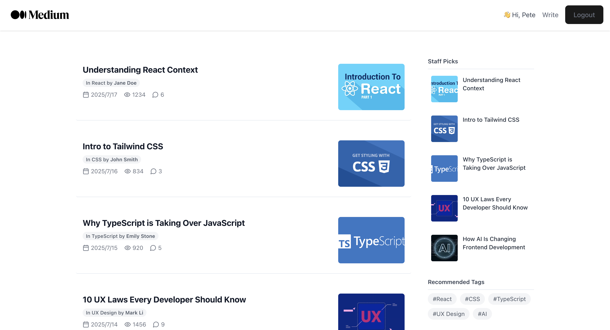
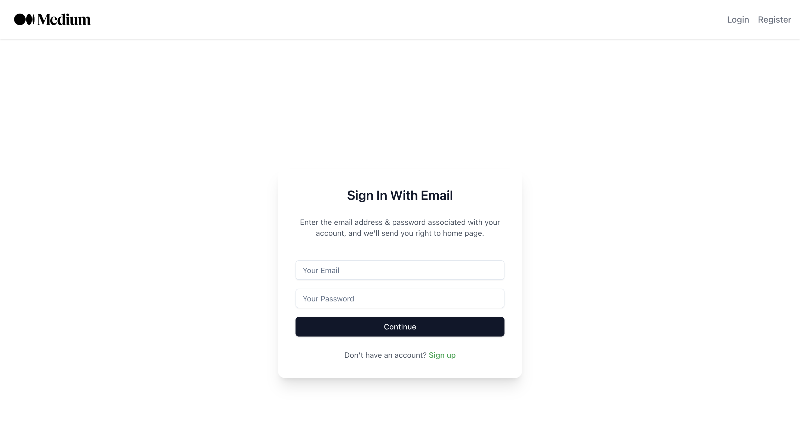
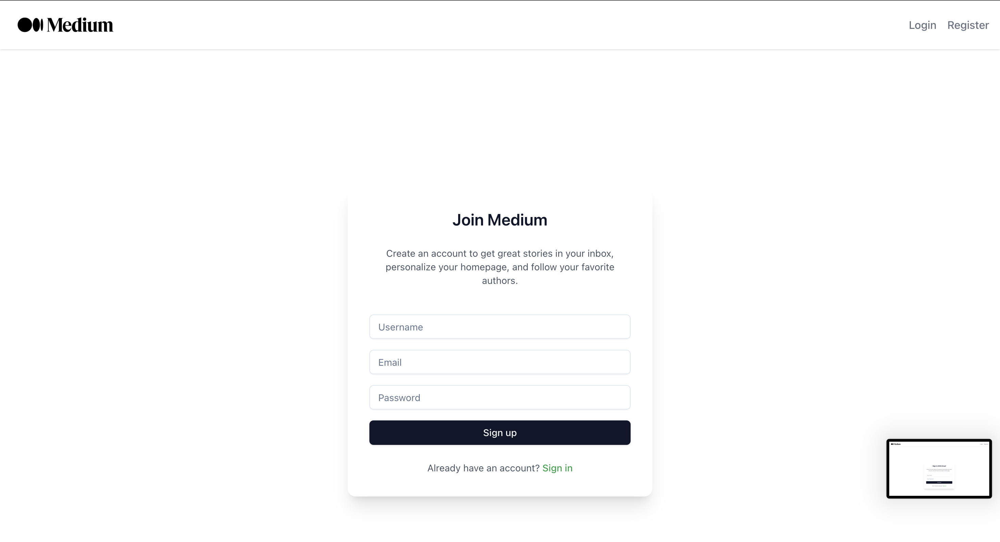
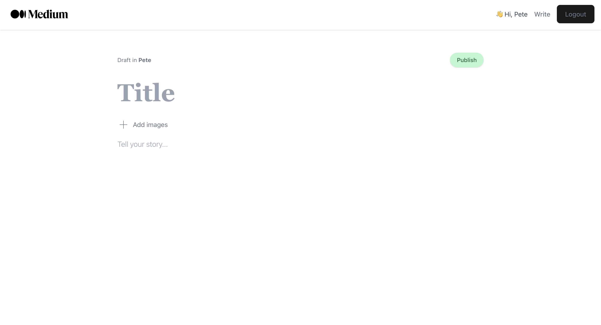

Medium Clone – Full Stack Blogging Platform

A minimalist blogging platform inspired by Medium, built with modern web technologies.

Overview

This project replicates the core features of a publishing platform like Medium, allowing users to:

	•	Register and log in via JWT authentication
 
	•	Write and publish blog posts with image uploads
 
	•	Browse articles on the homepage
 
	•	View individual post details
 
	•	Navigate through a responsive UI with recommended posts and tags
 

The application is fully functional in a local development environment.

⸻

Motivation

This project was initiated as a full-stack practice exercise to solidify understanding of:

	•	React component design and routing with react-router-dom
 
	•	Modern UI architecture using Tailwind CSS and shadcn/ui
 
	•	Client-server communication via RESTful APIs
 
	•	Basic JWT-based authentication flow
 
	•	Form handling, input validation, and image processing on the frontend
 
	•	Scalable backend API design using Express.js

The goal was to create a complete and cleanly organized blog platform while practicing frontend-backend integration.

⸻

Tech Stack

Frontend
	•	React – Component-based UI architecture
 
	•	TypeScript – Type-safe JavaScript for maintainability
 
	•	Tailwind CSS – Utility-first CSS framework for responsive design
 
	•	shadcn/ui – Pre-styled, accessible components for clean UIs
 
	•	React Router – Client-side routing
 
	•	axios – HTTP client for API calls
 
	•	jwt-decode – Decodes JWT tokens on the client

Backend
	•	Node.js + Express.js – REST API server
 
	•	JWT – Authentication mechanism
 
	•	body-parser – Parses incoming request bodies
 
	•	In-Memory Data (for now) – Temporarily stores users and posts during development

⸻

Features
	•	Responsive layout with sidebar
 
	•	Image upload with preview
 
	•	Token-based login/logout with localStorage
 
	•	Error handling and fallback behavior for missing posts

⸻

How to Run Locally
	1.	Clone the repository

git clone https://github.com/vern-h/medium-clone.git
cd medium-clone

	2.	Install frontend dependencies

cd frontend
npm install
npm run dev

	3.	Install backend dependencies

cd ../medium-clone-api
npm install
node index.js

Make sure the backend is running on http://localhost:3000.

⸻

How I Used AI

Throughout the project, AI tools were leveraged to:
	•	Plan and scaffold project structure: Prompted AI to propose optimal file separation and routing logic.
	•	Improve UI/UX copywriting: Used AI to rewrite button labels, error messages, and sidebar descriptions with a consistent tone.
	•	Debug backend logic: AI helped identify issues with req.body extraction, fallback rendering, and token decoding.
	•	Convert Markdown to HTML: AI converted draft content with markdown-like structure into valid, styled HTML blocks.
	•	Prompt Engineering: Prompts were refined iteratively to achieve:
	•	Context-aware TypeScript type generation for components
	•	Scalable and DRY component logic suggestions

This process demonstrates how AI assistance goes beyond code generation and acts as a full-stack design and implementation co-pilot.

⸻

Future Enhancements
	•	Migrate in-memory storage to MongoDB using Mongoose
 
	•	Add support for post editing and deleting
 
	•	Add user profile pages and post filtering
 
	•	Implement like/comment systems
 
	•	Deploy to production (e.g., Vercel + Render)

⸻

Screenshots
Home

Login

Register

Write

⸻

License

This project is for portfolio use.
